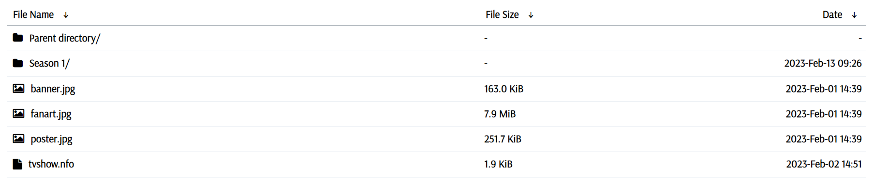

# Automatic FTP Folder Download

#### This script helps you download all the files in a FTP directory. Just go to the FTP directory on your browser and paste the script in the console and press enter. The browser will automatically start downloading the files.

### Note: the script doesn't download any directories inside the given directory, you simply have to browse to those directories and run the same script in the console.

###### Works for FTP directories like the following:

